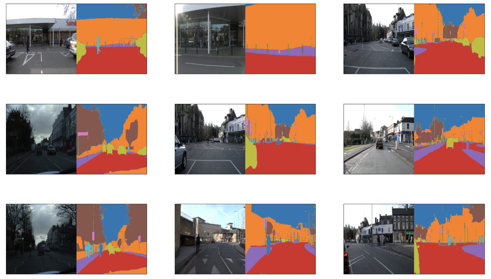
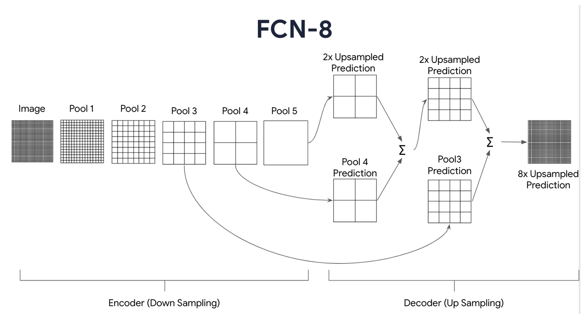
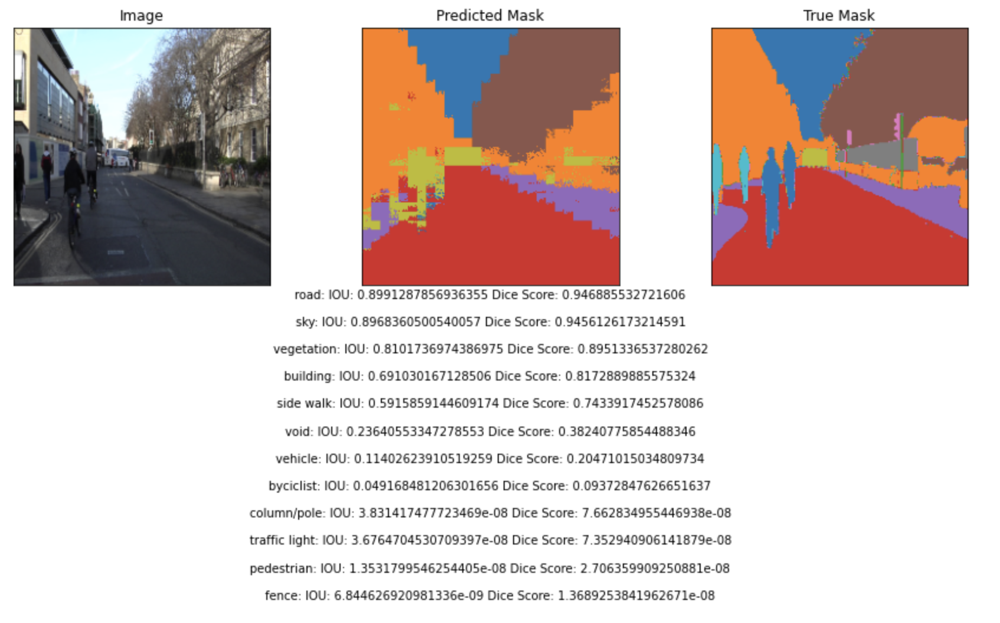

# Fully Convolutional Neural Networks for Image Segmentation of the CamVid dataset

## Table of Contents
* [General Info](#general-information)
* [Results](Results)
* [Technologies Used](#technologies-used)
* [Contact](#contact)
<!-- * [License](#license) -->

## General Information
- The goal of the project is to develop a model to perform image segmentation CamVid dataset
- I will train the model on a [custom dataset](https://drive.google.com/file/d/0B0d9ZiqAgFkiOHR1NTJhWVJMNEU/view?usp=sharing) prepared by [divamgupta](https://github.com/divamgupta/image-segmentation-keras). This contains video frames from a moving vehicle and is a subsample of the [CamVid](http://mi.eng.cam.ac.uk/research/projects/VideoRec/CamVid/) dataset. 

- I am using a Unet neural network architecture which consists of an encoder and decoder section. This architecture is also a fully convolutional network:

- I will be using a pretrained VGG-16 network for the feature extraction path, then followed by an FCN-8 network for upsampling and generating the predictions. The output will be a label map (i.e. segmentation mask) with predictions for 12 classes.
- The model achieves an accuracy of 84% on the validation set after 170 epochs.
- I ran the notebook on Arizona State University's supercomputing cluster using one Tesla V100 GPUs. The information regarding the GPUs is included at the end of the notebook.

## Results

<!-- If you have screenshots you'd like to share, include them here. -->

## Technologies Used
- Python
- Tensorflow
- Pandas
- Matplotlib
- Keras

## Contact
Created by [Miralireza Nabavi](anabavib@asu.edu) - feel free to contact me!
